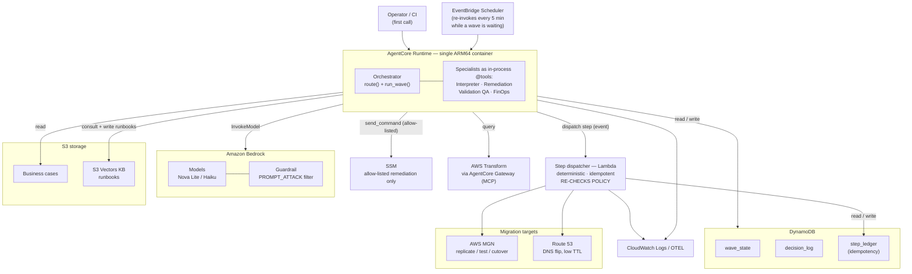
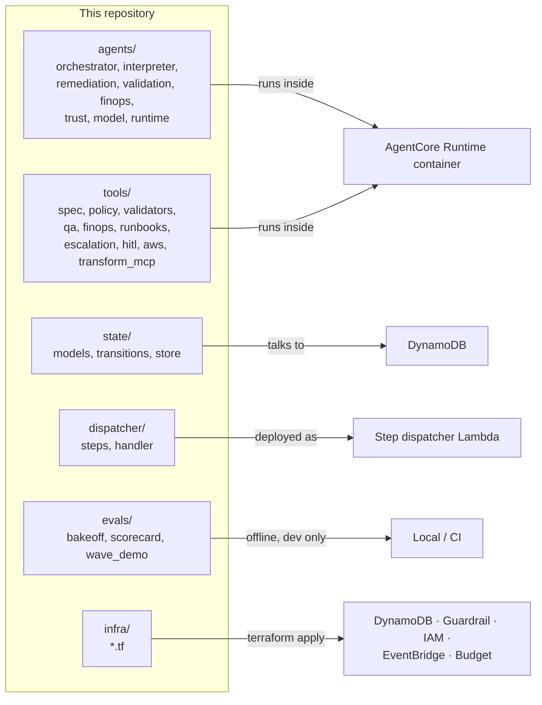
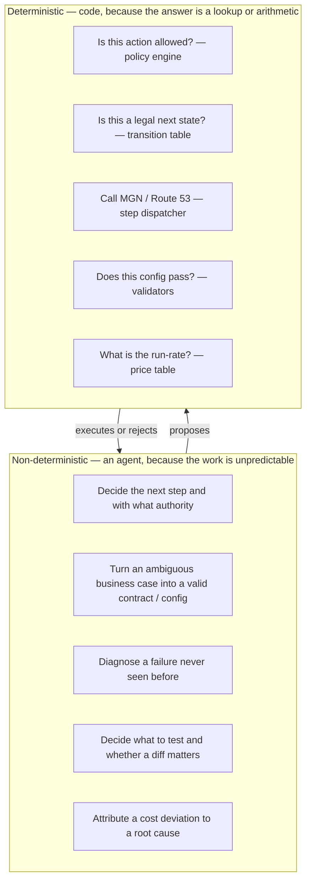

# Architecture

## In one paragraph

The whole system ships as **one container** (an AgentCore Runtime) that runs the Orchestrator agent
and its four specialist agents in-process. Around it sits a small set of AWS services: Bedrock for
the models, DynamoDB for state, one Lambda that is the *only* thing allowed to call mutating AWS
APIs, and the migration services themselves (MGN, Route 53). Infra is kept deliberately small — no
Control Tower, no always-on search cluster, no LZA unless someone turns it on.

The rule that shapes everything: **agents decide, code executes**. The Orchestrator has no AWS
credentials and no AWS API access. Every real effect goes through the deterministic step dispatcher,
which re-checks the policy itself before doing anything.

---

## Why one container, not five

A common first reaction is that each agent should be its own deployment. This system deliberately
does the opposite — the plan calls for **a single AgentCore Runtime with the specialists as
in-process `@tool`-wrapped agents** (the Strands *agent-as-tool* pattern).

| Reason | Detail |
|---|---|
| **It's a call tree, not a service mesh** | The Orchestrator calls a specialist, waits for the result, then decides the next step. Specialists don't run concurrently, don't have separate lifecycles, and don't scale independently. Splitting one workflow into 5 network services buys latency, partition failure modes *between your own agents*, 5 IAM roles and 5 cold starts — for nothing. |
| **The agents are stateless** | Wave status, decision log and the runbook KB all live in DynamoDB / S3. A per-agent deployment would be isolating nothing, because there's no local state to isolate. |
| **It keeps the measurement clean** | The PoC measures autonomy. Extra infra means extra infra failures that get mistaken for failures of judgment — the same reason the plan doesn't put an agent on routine work. |
| **The real trust boundary is elsewhere** | It isn't "agent A vs agent B" — they're the same trust level. It's *agents hold no mutating AWS APIs; only the dispatcher Lambda does, and it re-checks policy*. That holds regardless of how the agents are packaged. |

**The modularity is in the code, not the deployment.** Each specialist has its own context, system
prompt, tool allow-list, module, `build_*` factory and test file. The code boundary and the
deployment boundary don't have to match.

---

## Deployment topology

| Block | What it is | Why it's here |
|---|---|---|
| **AgentCore Runtime** | One container. `POST /invocations`, `GET /ping` on 8080. Runs the Orchestrator + 4 specialists as in-process tools. | Keeps all agent logic in one place; the specialists are function calls, not separate services. |
| **Bedrock (models + Guardrail)** | The LLMs the agents call. A Guardrail screens inputs for prompt-injection (Transform artifacts and logs are untrusted). | The agents' "judgement" runs here. The Guardrail is the input filter of the Guardrails pillar. |
| **DynamoDB — `wave_state`** | The current status and progress of each migration wave. | A wave runs for hours; its state can't live in a chat context or a Lambda's memory. |
| **DynamoDB — `decision_log`** | Every decision, denial, escalation, verdict and finding, appended in order. | The audit trail, and the raw data the autonomy scorecard reads. |
| **DynamoDB — `step_ledger`** | One row per `(wave_id, step_id)` that has run, with its result. | Makes the dispatcher idempotent across re-invocations — a replayed step returns the stored result instead of firing twice. |
| **Step dispatcher (Lambda)** | The only component that calls mutating AWS APIs (MGN start/cutover, Route 53 record changes). Re-evaluates the policy on every call. | The trust boundary. Even if the Orchestrator hallucinated an authorization, the dispatcher rejects it. This is why the executor can't be an agent. |
| **AWS MGN** | Copies running servers into AWS, keeps them synced, performs test launches and cutover. | The actual migration mechanism. |
| **Route 53** | DNS records for the apps, with low TTL. | Cutover = flip DNS to the migrated servers; rollback = flip it back. Low TTL makes both fast and reversible. |
| **SSM** | Runs remediation commands on hosts. Restricted to the documents in `contract.allowed_actions`, enforced in code. | Remediation is the only agent that writes; SSM is how it acts. |
| **AWS Transform (via AgentCore Gateway)** | The MCP server that produces the business case, TCO comparisons and modernization scenarios. | This team consumes and validates Transform's output; it does not recompute it. |
| **S3 + S3 Vectors KB** | Business-case documents; the runbook knowledge base. | Long-term memory. S3 Vectors, never OpenSearch Serverless (a 24/7 cost floor). |
| **EventBridge Scheduler** | Fires every 5 minutes while a wave is in a long wait, created disabled. | Re-invokes the Runtime so replication (hours long) never blocks a session. `run_wave` is resumable, so it's the same call each time. |
| **CloudWatch Logs / OTEL** | Observability. | Traces and logs from the Runtime and the dispatcher. |
| **IAM roles (two, split)** | *Runtime role*: DynamoDB on `wave_state` + `decision_log`, `bedrock:InvokeModel`, MGN **read only**, `lambda:InvokeFunction` on the step dispatcher, SSM `SendCommand` (allow-listed), Logs read, S3 read. *Step-dispatcher role*: `step_ledger`, MGN **Start\*/FinalizeCutover**, Route 53 record changes, its own logs. | The mutating actions live only on the Lambda's role. The deny-list ("never delete accounts, never touch management SCPs, never write to the source environment") is the *absence* of those grants, not a prompt. |

---

## Where the code runs

- **`agents/` + `tools/`** are packaged into the Runtime container.
- **`dispatcher/handler.py`** is the Lambda; `dispatcher/steps.py` (the `Dispatcher` + ledger) is
  shared by both the container and the Lambda.
- **`state/store.py`** has two interchangeable implementations: `InMemoryStateStore` (tests, local
  runs) and `DynamoDbStateStore` (deployed).
- **`evals/`** never ships — it's the bake-off, the scorecard and the demo, run locally or in CI.
- **`infra/`** is Terraform for everything that isn't the container itself.

---

## The three pillars, in infrastructure terms

| Pillar | Where it lives |
|---|---|
| **Memory** — context that survives a step | DynamoDB (`wave_state`, `decision_log`) for the run; S3 Vectors KB for runbooks. The legal-transition table is in code, not a table. |
| **Guardrails** — limits the agent can't argue with | Bedrock Guardrail (input filter) → deterministic validators before any effect (output check) → policy engine + per-agent tool allow-lists + the least-privilege IAM role (permissions). The dispatcher re-checks policy server-side. |
| **Trust** — verification, not hope | The `converge` loop: generate → validate against a deterministic oracle → regenerate. The Interpreter's oracle is `validate_lza_config`; extraction's oracle is the contract schema. Cheap models don't need to be right first try, they need to converge. |

---

## Trust boundary: agent vs. code

The single most important line: **the step dispatcher re-evaluates the policy on its own**, using
the same contract, before it touches AWS. The Orchestrator's approval is not trusted. That is the
argument for the security review, and the reason the executor is a Lambda and not an agent.

---

## What is *not* deployed (on purpose)

- **No Control Tower, no LZA** unless `feature_flags.lza_enabled` is turned on. Off by default, so
  the whole "disposable Organization + 3 mandatory accounts + CodeBuild quotas" prerequisite list
  does not apply.
- **No OpenSearch Serverless.** The Knowledge Base uses S3 Vectors. An AWS Budget alerts at 50% of
  $100/month as the tripwire.
- **No standing infra for the experiment.** The three-mode comparison runs against this same
  deployment; nothing extra to provision.
