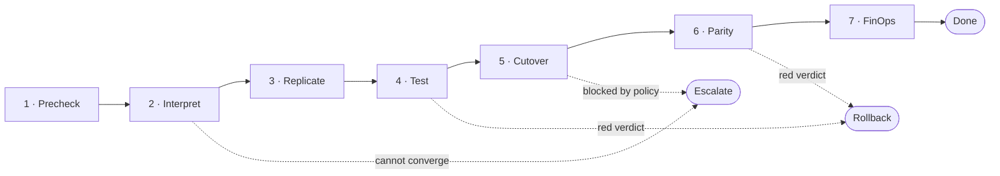

# How it works

*Written to be read by anyone. No AWS background needed — terms are explained in the glossary at the
bottom.*

---

## The problem, in plain words

Moving a company's servers into AWS is a long checklist. Roughly:

1. Set up the AWS foundation (accounts, networking, guardrails).
2. Copy each server into AWS and keep the copy in sync.
3. Test the copies.
4. Switch live traffic from the old servers to the copies.
5. Check nothing broke.
6. Confirm the monthly bill actually went down.

Normally a person drives every step and, when something looks off, decides what to do. This system
puts an **AI agent in the driver's seat for the judgement calls** and keeps plain, predictable code
for the mechanical parts. It also **writes down every decision**, so afterwards we can measure how
much of the work ran without a human touching it.

---

## The cast

| Who | Job | Thinks or follows rules? |
|---|---|---|
| **Orchestrator** | The driver. Picks the next step and checks it's allowed before doing it. | Thinks |
| **Interpreter** | Reads the customer's write-up (free-form text) and turns it into a small, strict rulebook called the *decision contract*. Also writes the AWS foundation config. | Thinks |
| **Remediation** | When something breaks that nobody has seen before, it figures out the fix, applies it, and saves it as a *runbook* so next time is instant. | Thinks |
| **Validation QA** | After the traffic switch, decides what to test and whether the result is good enough. If not, it **rolls back immediately** — it does not wait for a human. | Thinks |
| **FinOps** | Checks the real monthly cost against the promised budget and explains any gap. | Thinks |
| **Policy engine** | Answers one question: "is this specific action allowed by the contract?" Pure rules, no AI. | Follows rules |
| **State machine** | Answers: "is this a legal next step?" A fixed table. | Follows rules |
| **Step dispatcher** | The only part that actually calls AWS to change things. Re-checks the policy itself first. | Follows rules |
| **Decision log** | Writes down every choice, denial, verdict and finding, in order. | Just records |

The agents that "think" run on a language model. Everything that "follows rules" is ordinary code
and always gives the same answer for the same input.

---

## One migration wave, step by step

A **wave** is one batch of servers migrated together. Here is a wave running **fully autonomously**
(no human in the loop). The Orchestrator walks these steps in order:

### 1. Precheck
A quick sanity check by plain code: does the decision contract have steps and rules in it? If it's
empty or malformed, the wave **escalates** (see safety nets) instead of proceeding on a bad premise.

### 2. Interpret
The **Interpreter** generates the AWS foundation configuration. It doesn't just hand it over — it
runs the config through a deterministic checker, and if the checker rejects it, the Interpreter
reads the error and tries again, up to five times.

- Passes the checker within five tries → move on.
- Still failing after five → **escalate**, with a note on what went wrong.

### 3. Replicate
The **step dispatcher** tells AWS MGN to start copying the servers. This takes **hours**. The system
does not sit and wait — it returns "waiting" and stops. A scheduled trigger wakes it every five
minutes; each time it checks whether the copy has finished. When it has, the wave moves on.

If the copy itself fails (e.g. a stalled agent), **Remediation** gets a chance to fix it. If it
can't, the wave **escalates**.

### 4. Test
**Validation QA** decides *what* to test based on how critical the app is, runs those checks, and
looks at the differences between the old and new system's responses (API and schema diffs). It then
issues a verdict:

- **Green** → move on.
- **Red** → **rollback** immediately.

If the model's answer is unreadable or ambiguous, the verdict defaults to **red**. A false "green"
(saying a broken migration is fine) is the worst possible outcome, so the system leans the safe way.

### 5. Cutover
The Orchestrator first asks the **policy engine**: is a cutover allowed right now? (Is the projected
cost within budget? Is this a blackout window? Is this server in scope?) If not allowed, the wave
**escalates**.

If allowed, the **step dispatcher** flips the DNS records to point at the migrated servers (with a
low TTL so the change is fast and reversible) and tells MGN to cut over. **The dispatcher re-runs
the same policy check itself** — it does not take the Orchestrator's word for it.

### 6. Parity
**Validation QA** again, now *after* the switch: does the migrated system behave like the original?
Same rule — green moves on, red rolls back.

### 7. FinOps
**FinOps** calculates the real monthly cost from the instance types and storage that actually
launched, and compares it to the budget ceiling plus its tolerance.

- Within budget → records the finding, wave is **done**.
- Over budget → the model attributes the cause (e.g. "storage over-provisioned on the billing
  tier"). If the resources aren't tagged and the cost can't be pinned down, it reports **"not
  attributable"** rather than inventing an explanation.

---

## The two safety nets

### Rollback — automatic, no human
Triggered only by a red verdict at **Test** or **Parity**. The DNS flips back to the original
servers. MGN keeps replicating in the background, so you can try the cutover again later. No data is
lost and no human is needed. This is what makes an autonomous cutover safe to authorize: the wave is
**reversible without intervention**.

### Escalation — stop and ask, with a diagnosis
When an agent has used up its retry budget, or hits something its tools genuinely don't cover
(classic example: "modernize this PHP app" — AWS Transform doesn't handle PHP), it **stops** and
writes an escalation entry: the context, its best hypothesis, and everything it tried. A human picks
it up from there.

Every escalation is **a measured data point, not a failure**. One of the project's five formal
deliverables is exactly this: the system saying, explicitly, "here is what I cannot do."

---

## How we measure "autonomy"

After a run, the **scorecard** reads the decision log and computes, among others:

- **Unintervened success rate** — runs that finished with zero escalations.
- **Escalations per run** — how often it had to ask for help.
- **Interpreter convergence** — how often the config passed, and in how many tries.
- **Remediation** — failures resolved vs. escalated, and how often a *known runbook* did the job
  instead of fresh reasoning (this is the "gets better between runs" number).
- **False green** — a broken cutover marked OK. **Target: zero.** The dangerous one.
- **False red** — a healthy migration rolled back. Costly, not dangerous.
- **Constraint adherence** — did the policy engine catch every trap in the contract?
- **Diagnosis precision** — for deliberately injected failures, did Remediation pick the right fix?
- **Cost per successful run** — not cost per token; cost per finished migration.

Anything that needs a human-labeled "ground truth" we don't have yet (was this migration actually
healthy? what was the real cost?) shows up as **"not measured"** with a note — never a made-up
number.

---

## Glossary

| Term | Meaning |
|---|---|
| **Wave** | One batch of servers migrated together. |
| **Business case** | The free-form document (prose + AWS Transform output) describing what to migrate and why. |
| **Decision contract** | The small, strict JSON the Interpreter derives from the business case: budget, constraints, and the list of steps. It's what the rule-based parts read. |
| **Constraint / predicate** | A single rule, like "no ARM64 on this server" or "minimum 2 vCPU". The *types* of rule are a fixed list; the actual rules come from the document. |
| **MGN** | AWS Application Migration Service. Copies a running server into AWS block-by-block, keeps it in sync, then performs the "cutover". |
| **Cutover** | The moment live traffic moves from the old server to the migrated copy. |
| **Rollback** | Moving traffic back to the old server. |
| **Run-rate** | The projected monthly cost based on what's currently running. |
| **Landing zone / LZA** | The multi-account AWS foundation (and AWS's tool for building it). Off by default in this system. |
| **Runbook** | A saved "this failure → this fix" entry, so a known problem isn't re-diagnosed from scratch. |
| **Escalation** | An agent stopping and handing off to a human, with a written diagnosis. |
| **HITL** | Human-in-the-loop. Here there is exactly one such gate: approving the derived contract (mode 1). |
| **Decision log** | The ordered record of every choice the system made. The audit trail and the scorecard's input. |
| **Guardrail** | A Bedrock feature that screens model input/output — here, for prompt-injection hidden in Transform artifacts or logs. |
